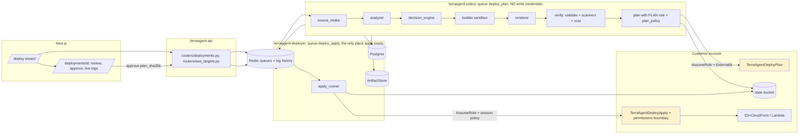

# Design: Code → AWS Deployment (deployment mode)

Implementation plan for a second TerraAgent mode: a user uploads a ZIP or connects a GitHub
repository, and TerraAgent analyses the project, recommends a deployment target, generates
Terraform from vetted templates, verifies and plans it, and — after explicit human approval —
applies it with short-lived, least-privilege STS credentials.

"Current state" statements are grounded in the code as of 2026-10-02; everything else is the plan
that implementation must follow.

> **Status: Phases 1–4A implemented & verified** (see "Implementation status" below). Phase 4B follows behind the Executor interface.

## Implementation status (Phases 1–4A)

Shipped in `backend/deploy/` (`apply_runner.py`, `executor.py`, `plan_bundle.py`, `plan_policy.py`, `sts.py`, `store.py`), `backend/routers/deployments.py`, `backend/routers/aws_targets.py`, `frontend/app/deploy*`, with 116 automated tests in `backend/tests/test_deploy_*.py`.

Where the build differs from the plan below, the code is authoritative:

| Plan | As built | Why / follow-up |
|---|---|---|
| `deploy/state_machine.py` | `deploy/store.py` (state machine + records) | One module owns the table and its only writer |
| `POST /deployments/sources/*` then `POST /deployments` | `POST /deployments/upload` and `/deployments/github` create the deployment and start analysis; `POST /deployments/{id}/prepare` picks the target and settings | Fewer round trips; the token still never leaves the request handler |
| Builder in its own container (§9.2) | Runs in the existing worker: wheels-only pip, `npm ci --ignore-scripts`, `check_build_argv`, minimal env with no credentials | No project code runs either way; the separate container moves to Phase 6 |
| Single apply path (§6.4) | `deploy/apply_runner.py::apply_approved` | Strictly on `deploy_apply` queue with `TERRAAGENT_DEPLOY_ENABLED=true`, verified plan bundle sha256, locked argv |
| Executor abstraction (§6.5) | `deploy/executor.py` (`StsApplyExecutor`) | Unifies direct STS apply (4A) and GitOps PR (4B) behind one interface |

Open item to verify against a real account in Phase 3/4: the `lambda_http` template grants
public access through `lambda:InvokeFunctionUrl` (`function_url_auth_type = "NONE"`). Check
whether newer AWS accounts also require a `lambda:InvokeFunction` grant for public function URLs.

---

## 0. Scope in one paragraph

**Migration mode** (today's 4-agent graph) stays exactly as it is: read-only discovery, never
applies. **Deployment mode** is a separate package, queue, worker container, IAM role pair
and set of tables. It never runs Terraform the user wrote — only TerraAgent's own templates, with
the user's code treated purely as data (an S3 object, a Lambda zip). Every security-relevant
decision (target choice, IAM, plan acceptance, apply) is deterministic; no LLM is involved, and no
new LangGraph agents are created.

**V1 targets:** static sites → S3 + CloudFront; Python/Node functions → Lambda with an HTTP
endpoint. ECS/Fargate, application builds that run user code, custom domains, databases and
teardown are later phases.

---

## 1. Decisions required before the gated phases

| ID | Decision | Proposed default | Gates |
|---|---|---|---|
| D1 | Amend CLAUDE.md hard rules #1 and #3 for deployment mode only (text in Appendix A) | Approve, with the boundary in §6.4 | Phase 4 |
| D2 | Executor: TerraAgent applies with STS, or TerraAgent opens a PR and the team's OIDC CI applies. This reverses the earlier "PR + CI apply, Terraform-only" answer | Build the `Executor` interface (§6.5); V1 ships `StsApplyExecutor`; `GitOpsPrExecutor` follows in Phase 5 | Phase 3 |
| D3 | Approver identity. Today's auth is one shared API key (`services/auth.py`), which can't attribute an approval to a person | oauth2-proxy (SSO) in front of nginx, trusted `X-Forwarded-Email`; plus an optional four-eyes rule (requester ≠ approver) | Phase 3 |
| D4 | Platform identity for the workers | Workers run with their own instance/task role and assume the customer's roles with a per-tenant ExternalId; customers enter no keys. Self-hosted fallback: keys re-entered at approval, kept in memory only | Phase 3 |
| D5 | State locking | Upgrade Terraform in the Dockerfile from 1.8.5 to ≥1.10 and use S3 native locking (`use_lockfile = true`); no DynamoDB table needed | Phase 3 |
| D6 | Where artifacts live | Platform `ArtifactStore`: local volume (self-hosted) or a platform-owned S3 bucket with SSE-KMS | Phase 1 (interface), Phase 6 (S3 default) |
| D7 | Per-target limits | Max 50 resources per plan, max $200/month estimate, max 2,000 static files, 25 MB upload | Phase 3 |

---

## 2. Current-state findings that shape the plan

1. **The guardrail is real.** `tools/terraform_runner.py::check_argv` allows only
   `version/fmt/init/validate/plan/show/providers` and blocks `apply/destroy/import` anywhere in
   argv. **It does not change.** Apply gets its own chokepoint in a separate module (§6.4).
2. **The STS pattern exists.** `tools/sts_helper.py::assume_role` uses 1-hour credentials and an
   ExternalId. Deployment reuses it and adds a `Policy` (session policy), `Tags`,
   `SourceIdentity` and a shorter `DurationSeconds`.
3. **Celery arguments carry raw AWS keys today.** `routers/scan.py::start_scan` puts
   `aws_access_key`/`aws_secret_key` in `run_scan_task`'s args, so they sit in the Redis broker.
   Deployment tasks take **IDs only**. Fixing the scan path is tracked separately (Phase 6).
4. **A blind retry is unsafe for apply.** `task_acks_late=True` redelivers a killed task, and
   `sweep_stale_jobs` marks long-running jobs FAILED. Neither is acceptable for an apply that
   might be half done (§8).
5. **There is no S3 artifact store.** Bundles go to the `OUTPUT_DIR` volume with a 24-hour
   cleanup (`cleanup_expired_zips`).
6. **The existing CI deployer role is over-privileged.** `infra/bootstrap-aws-oidc/main.tf`
   attaches `PowerUserAccess`. Deployment mode gets its own bootstrap (§7) and must not reuse it.
7. **Uploads over 10 MB are silently cut off.** In the frontend, `proxy.ts` (Next 16) buffers
   bodies up to `experimental.proxyClientMaxBodySize`, which defaults to 10 MB, and **truncates
   larger bodies silently**. nginx already allows 50 MB.
8. **Reusable as-is:** `CredentialScrubber`, `sandbox_registry`, `hcl_render.hcl_str`, the
   Checkov/Trivy/Conftest/Infracost runners, `redis_service.publish_log` with its log-history
   replay, `tools/github_repo.normalize_repo`, `services/github_client._handle_api_error`, and
   the UI primitives in `frontend/components/ui.tsx`.
9. **Tables are added without migrations.** `services/database.py::init_db` runs `create_all`
   and adds missing nullable columns, so new tables need no Alembic.

---

## 3. Architecture



### 3.1 Deployment state machine (`deploy/state_machine.py`)

```
SOURCE_RECEIVED -> ANALYZING -> ANALYZED -> BUILDING -> VERIFYING -> PLANNING -> AWAITING_APPROVAL
AWAITING_APPROVAL -> APPROVED -> APPLYING -> DEPLOYED
AWAITING_APPROVAL -> REJECTED | EXPIRED          (approval window: 24h, plan binary deleted)
any pre-apply state -> FAILED                    (nothing changed in AWS)
APPLYING -> FAILED_PARTIAL                       (terraform exited non-zero; state is authoritative)
APPLYING -> NEEDS_RECONCILIATION                 (worker lost mid-apply; human runbook)
ANALYZED -> (target override) -> BUILDING        (re-plan with a different eligible target)
DEPLOYED | FAILED_PARTIAL -> PLANNING            (redeploy / retry = a new plan + a new approval)
```

`transition(deployment_id, to, actor, reason, **data)` is the **only** writer of
`deployments.status`. It checks the transition against this table inside a row lock
(`SELECT ... FOR UPDATE`) and appends a `deployment_events` row in the same transaction.

### 3.2 Why there are no new agents

Each step is a rule or a tool call. A Postgres state machine plus Celery tasks is easier to audit
than `interrupt()` and checkpoints, and it doesn't have to strip credentials from checkpoints. The
UI still presents deployment as stages (Analyze → Build → Verify → Plan → Approve → Deploy), using
the same patterns as `ScanProgress`.

---

## 4. Work breakdown by phase

Sizes: S ≈ ≤1 day, M ≈ 2–4 days, L ≈ 1–2 weeks (one engineer).

### Phase 0 — Guardrails and decisions (S, no code)
- [ ] 0.1 Owner signs off D1–D7.
- [ ] 0.2 Merge the CLAUDE.md amendment (Appendix A) and the new "Deployment mode" section.
- [ ] 0.3 Threat model review of §9 by a second engineer.

**Exit:** decisions recorded in this file; CLAUDE.md updated.

### Phase 1 — Source intake, analyzer, decision engine (M–L, no AWS, no Terraform)

| # | Work | Files |
|---|---|---|
| 1.1 | `ArtifactStore` protocol + `LocalArtifactStore` (content-addressed by sha256; `put/get/delete/expire`; optional Fernet encryption, key from `TERRAAGENT_ARTIFACT_KEY`) | `backend/deploy/artifacts.py` |
| 1.2 | Safe extraction (§9.1): streaming reads, caps, path normalisation, symlink/encrypted-entry rejection, single-top-dir strip (GitHub archives), re-zip of the normalised tree | `backend/deploy/source_intake.py` |
| 1.3 | GitHub source: `GET /repos/{repo}/zipball/{ref}` with a one-use token; the redirect must land on `codeload.github.com`; streamed with a size cap; `normalize_repo` + ref regex `^[A-Za-z0-9._/-]{1,200}$` with no `..` | `backend/deploy/source_intake.py` |
| 1.4 | Secret scan: block on `CredentialScrubber` regex hits, PEM private-key headers, `*.tfstate*`, `.env*`, `id_rsa*`; report the path and line numbers, never the value | `backend/deploy/secret_scan.py` |
| 1.5 | Analyzer → `ProjectProfile` (§5.1); a pure function, never executes anything | `backend/deploy/analyzer.py` |
| 1.6 | Decision engine → `Decision` (§5.2); a versioned rule table | `backend/deploy/decision_engine.py` |
| 1.7 | ORM models `deployments`, `deployment_events`, `deployment_artifacts` + `transition()` | `backend/models/orm.py`, `backend/deploy/state_machine.py`, `services/database.py::init_db` |
| 1.8 | Endpoints: sources (upload/github), `POST /deployments` (runs to `ANALYZED`), `GET /deployments`, `GET /deployments/{id}` | `backend/routers/deployments.py`, `backend/models/deployment.py`, `main.py` |
| 1.9 | Celery task `deploy.analyze` on queue `deploy_plan` (IDs-only args) | `backend/deploy/tasks.py`, `services/celery_app.py` |
| 1.10 | Frontend: `/deploy` steps 1–2 (source, then analysis + recommendation with evidence); `/deployments` list; Sidebar entry; `proxyClientMaxBodySize: "26mb"` | `frontend/app/deploy/`, `frontend/app/deployments/`, `frontend/lib/{api,types}.ts`, `Sidebar.tsx`, `next.config.js` |
| 1.11 | Add `python-multipart` to `requirements.txt` explicitly (FastAPI uploads) | `backend/requirements.txt` |

**Exit:** an "analysis report" deployment works end to end with no AWS account; all §10.1 tests pass.

### Phase 2 — Templates, builder, verification, cost (L, still no credentials)

| # | Work | Files |
|---|---|---|
| 2.1 | Template modules with pinned providers and a committed `.terraform.lock.hcl`: `static_site/` (private S3 bucket, OAC, CloudFront, `aws_s3_object` for_each with content types + `filemd5` etags), `lambda_http/` (execution role under `/terraagent/` with the workload boundary, `aws_lambda_function` from `filename` + `source_code_hash`, Function URL or HTTP API, log group with retention) | `backend/deploy/templates/*` |
| 2.2 | Renderer: copies the template, writes `terraform.tfvars.json` (JSON, not HCL, so user strings never become syntax), places build artifacts under `artifacts/`, writes `backend.tf` from the target config | `backend/deploy/renderer.py` |
| 2.3 | Builder sandbox (§9.2): static = copy the detected output dir; Python = `pip install --only-binary=:all: --no-deps`-resolved wheels into `package/`; Node = `npm ci --ignore-scripts --omit=dev`; zip; sha256. Runs in a separate container with no credentials | `backend/deploy/builder.py`, `docker/builder/Dockerfile`, compose service `terraagent-builder` |
| 2.4 | Verify: reuse `TerraformRunner.validate_hcl`, then `CheckovRunner`/`TrivyRunner`/`ConftestRunner`, then `InfracostRunner.estimate_cost` for the full stack. Fail closed: a failed scanner → `VERIFYING` ends `FAILED` with the reason, never a silent pass | `backend/deploy/verify.py` |
| 2.5 | CI job: every template passes `terraform validate` plus all three scanners with zero HIGH/CRITICAL findings | `.github/workflows/ci.yml` |
| 2.6 | UI step 3 (settings: environment, memory/timeout for Lambda, price class for CloudFront) + verification results | `frontend/app/deploy/` |

**Exit:** a deployment reaches `VERIFYING → (ready to plan)` with rendered Terraform, a security
report and a cost estimate, viewable and downloadable (redacted).

### Phase 3 — Deploy targets, plan, approval gate, identity (L) — needs D2–D5, D7

| # | Work | Files |
|---|---|---|
| 3.1 | Customer bootstrap (§7) as CloudFormation + Terraform, with a guide | `deploy/bootstrap/`, `docs/aws/deploy-roles.md` |
| 3.2 | `aws_deploy_targets` table + `POST/GET /aws-targets` + `POST /aws-targets/{id}/verify` (assume both roles, `GetCallerIdentity`, check the state bucket is reachable) | `backend/routers/aws_targets.py`, `models/orm.py` |
| 3.3 | `deploy/sts.py`: `plan_session(target, deployment)` / `apply_session(...)` wrapping `assume_role` with a session policy, tags and SourceIdentity (§7.3) | `backend/deploy/sts.py`, extend `tools/sts_helper.py` with optional kwargs |
| 3.4 | `IaCEngine`/`TerraformRunner.plan_saved(...)`: `init` with `-backend-config` from the target, `plan -out=tfplan -input=false -lock-timeout=5m`, `show -json tfplan`. Goes through `check_argv` unchanged. Returns the plan binary, redacted plan JSON, counts and sha256 | `backend/tools/terraform_runner.py` |
| 3.5 | **Plan bundle:** the exact workdir (rendered files, artifacts, lock file — no `.terraform/`) + `tfplan`, hashed together as `plan_bundle_sha256`, stored encrypted | `backend/deploy/plan_bundle.py` |
| 3.6 | Plan policy (§9.3): Python checks + Conftest on the plan JSON (`security/policies/deploy/*.rego`) | `backend/deploy/plan_policy.py`, `security/policies/deploy/` |
| 3.7 | Identity (D3): `services/identity.py::current_user(request)`; `requested_by` on create; approval requires a user | `backend/services/identity.py` |
| 3.8 | `POST /deployments/{id}/approve` `{plan_bundle_sha256, confirm: true, acknowledge_destructive?, reason}` and `/reject`. Reject on a hash mismatch, expiry, self-approval (when four-eyes is on) or a missing identity | `backend/routers/deployments.py` |
| 3.9 | Log streaming: `GET /deployments/{id}/logs` (SSE) + `/logs/history`, reusing `redis_service` with key `deploy:{id}` | `backend/routers/deployments.py` |
| 3.10 | UI step 4: plan review (per-address actions, a destructive tier using the existing wording, IAM summary, cost, findings) + an approve dialog that shows the hash; Settings → Deploy targets | `frontend/app/deployments/[id]/`, `frontend/app/settings/` |

**Exit:** a deployment reaches `AWAITING_APPROVAL` against a real sandbox account using only the
plan role; approval is recorded with a real identity; nothing is applied yet.

### Phase 4 — Apply (M–L) — needs D1

| # | Work | Files |
|---|---|---|
| 4.1 | `apply_runner` (§6.4) | `backend/deploy/apply_runner.py` |
| 4.2 | `terraagent-deployer` container: same image, `command: celery ... -Q deploy_apply --concurrency 1`, env `TERRAAGENT_DEPLOY_ENABLED=true`, platform identity; the existing worker never consumes `deploy_apply` | `docker-compose.yml` |
| 4.3 | Task `deploy.apply` with the semantics in §8 (lease, no retries, reconciliation) | `backend/deploy/tasks.py` |
| 4.4 | Outputs: `terraform show -json` of state after apply → URL/ARNs into `outputs_json`; plan binary deleted | `backend/deploy/apply_runner.py` |
| 4.5 | UI step 5: live logs, outputs, link to the app; `NEEDS_RECONCILIATION` runbook panel | `frontend/app/deployments/[id]/` |
| 4.6 | CLAUDE.md "Deployment mode" section finalised to match the code | `CLAUDE.md` |

**Exit:** static site and Lambda deploy end to end in the sandbox account behind the feature flag;
§10.2 guardrail tests pass in CI.

### Phase 5 — Rollback, teardown, ECS, GitOps executor (L)
- 5.1 Application rollback: Lambda — publish versions plus a `live` alias, rollback moves the alias
  (a planned, approved change); static — versioned S3 prefixes plus a CloudFront `origin_path` switch.
- 5.2 Teardown: `plan -destroy` limited to this deployment's own state → the same approval gate with
  a mandatory destructive acknowledgement → `apply_runner` with `kind="destroy_plan"`.
- 5.3 ECS/Fargate + ALB template; the image is built by **CodeBuild in the customer's account**
  (Dockerfile = untrusted code, so it never runs on TerraAgent infrastructure); ECR with scan-on-push.
- 5.4 `GitOpsPrExecutor`: commit the rendered project to a repo and open a PR using
  `services/github_client._publish`; the team's OIDC CI applies.

### Phase 6 — Hardening (M)
- 6.1 `S3ArtifactStore` (SSE-KMS, lifecycle) as the default outside dev.
- 6.2 Remove raw keys from `run_scan_task` args (finding 2.3).
- 6.3 Per-tenant ownership checks on jobs and deployments.
- 6.4 End-to-end suite against the sandbox account on a schedule.

---

## 5. Analyzer and decision engine

### 5.1 `ProjectProfile`

```python
class Evidence(TypedDict):
    file: str
    rule: str          # e.g. "node.dep.express"

class ProjectProfile(TypedDict):
    runtime: Literal["python", "node", "static", "container", "unknown"]
    runtime_version: Optional[str]        # .python-version, engines.node, FROM tag
    framework: Optional[str]              # fixed table: flask, fastapi, django, express, fastify, nest, next, vite, react
    entrypoint: Optional[str]             # "app.handler", "index.handler", "index.html"
    lambda_handler: Optional[str]         # detected def handler(event, context) / exports.handler
    listens_on_port: Optional[int]        # EXPOSE, uvicorn --port, app.listen(
    build_required: bool                  # scripts.build present and no committed output dir
    static_output_dir: Optional[str]      # dist/, build/, out/, public/ containing index.html
    dependency_count: int
    native_dependencies: List[str]        # from a fixed list (psycopg2, numpy, ...) → wheels-only check
    estimated_package_mb: Optional[float]
    has_dockerfile: bool
    evidence: Dict[str, List[Evidence]]   # one entry per field above
    warnings: List[str]
```

Rules are table driven (`ANALYZER_RULES`), read file contents with the `json`/`tomllib` parsers or
anchored regexes, and **never import or execute** project files.

### 5.2 Decision table (`DECISION_RULES_VERSION = 1`)

| Order | Condition | Eligible target | Reason code |
|---|---|---|---|
| 1 | Secret scan blocked | none | `blocked.secrets` |
| 2 | `runtime == static`, or `static_output_dir` set and no server entrypoint | `static_site` | `static.output_present` |
| 3 | `lambda_handler` set, `estimated_package_mb ≤ 50`, no port listener, native deps installable wheels-only | `lambda_http` | `lambda.handler_detected` |
| 4 | Server framework or port listener, and fits Lambda via an adapter | *not V1* — `ecs_service` in Phase 5 | `server.needs_container` |
| 5 | `build_required` and no committed output | none in V1 | `build.unsafe_in_v1` |
| 6 | Otherwise | none | `unknown.project_type` |

`Decision = {eligible: [...], recommended: str | None, reasons: [{code, message, evidence}], rules_version}`.
A user override may pick only from `eligible`.

---

## 6. Terraform integration

### 6.1 Template contract
- Each module: `versions.tf` (pinned `required_version` and `hashicorp/aws ~> 5.x`), `main.tf`,
  `variables.tf` (every variable typed and validated), `outputs.tf`, `.terraform.lock.hcl`.
- Every resource is named `terraagent-${var.deployment_id}-...` and tagged
  `terraagent:deployment-id`, `terraagent:managed = true`. The IAM conditions in §7 depend on
  both.
- No provisioners, no `external` data source, no `local-exec`; enforced by a template unit test
  using `tools/hcl_invariants` patterns plus `MUTATING_COMMAND_PATTERN`.

### 6.2 Variables, not syntax
User-derived values (names, env vars, memory sizes) reach Terraform only through
`terraform.tfvars.json`, validated by Pydantic and by Terraform `validation {}` blocks. The
renderer never concatenates user text into HCL.

### 6.3 State
`backend "s3" { bucket = <target.state_bucket>, key = "terraagent/<target_id>/<deployment_id>.tfstate",
region = ..., encrypt = true, use_lockfile = true }`, written by the renderer and passed via
`-backend-config` so the template stays generic.

### 6.4 `apply_runner` — the only apply path

```python
APPLY_ARGV = [binary, "apply", "-input=false", "-lock-timeout=5m", "-no-color", "tfplan"]

async def apply_approved(deployment_id: str) -> ApplyResult:
    # 1. refuse unless os.environ["TERRAAGENT_DEPLOY_ENABLED"] == "true"
    #    and the current Celery task's delivery_info["routing_key"] == "deploy_apply"
    # 2. load deployment FOR UPDATE; require status APPROVED, approval not expired,
    #    approved_by set; transition -> APPLYING (sets the lease)
    # 3. fetch the plan bundle; recompute sha256; must equal deployments.plan_bundle_sha256
    # 4. extract into a create_sandbox() dir
    # 5. apply_session(): AssumeRole(apply role, ExternalId, session policy, SourceIdentity=approver)
    # 6. TerraformRunner.run_command([binary, "init", ...backend-config...])   # through check_argv
    # 7. _run_apply(APPLY_ARGV, env=_scoped_aws_env(...))                     # the one exception
    # 8. scrubbed output -> publish_log; outputs via `show -json` (check_argv)
    # 9. transition -> DEPLOYED / FAILED_PARTIAL; delete plan binary; release_sandbox
```

`_run_apply` has its own validator, `check_apply_argv(cmd)`: the binary must be terraform/tofu,
argv must **equal** `APPLY_ARGV` (or `..., "tfplan.destroy"` once Phase 5.2 lands, only when
`deployment.plan_kind == "destroy"`), and `destroy`/`import`/`-auto-approve`/`-target`/`-replace`/`-var*`
are never present. `terraform_runner.check_argv` is **not** modified. A test asserts that
`deploy.apply_runner` is imported only by `deploy.tasks`.

### 6.5 Executor interface
`class Executor(Protocol): async def execute(self, deployment_id: str) -> ExecutionResult`.
`StsApplyExecutor` (Phase 4) wraps `apply_approved`; `GitOpsPrExecutor` (Phase 5) opens a PR. The
approval gate is the same for both.

---

## 7. IAM / STS model

### 7.1 Roles (customer bootstrap, `deploy/bootstrap/`)
**`TerraAgentDeployPlan`**
- `Describe*/Get*/List*` on the target services, the same data-read denies as
  `docs/aws/read-only-policy.json`
- On the state bucket: `s3:GetObject`, plus `s3:PutObject`/`s3:DeleteObject` only on `*.tflock`
- Trust: the TerraAgent platform principal + `sts:ExternalId`

**`TerraAgentDeployApply`**
- Allow the V1 services (S3, CloudFront, Lambda, API Gateway v2, CloudWatch Logs) only on
  `arn:...:terraagent-*` resources, or where `aws:ResourceTag/terraagent:managed = true`.
  Creates require `aws:RequestTag/terraagent:deployment-id`.
- IAM: `CreateRole`/`PutRolePolicy`/`AttachRolePolicy`/`DeleteRole*` only on
  `role/terraagent/*`, **with** `iam:PermissionsBoundary = arn:...:policy/TerraAgentWorkloadBoundary`.
  `iam:PassRole` only on `role/terraagent/*` with
  `iam:PassedToService ∈ {lambda.amazonaws.com}`.
- Explicit deny: `iam:CreateUser`, `iam:CreateAccessKey`, any change to `TerraAgentDeploy*` or the
  boundary, attaching `AdministratorAccess`/`PowerUserAccess`/`IAMFullAccess`, `organizations:*`,
  `kms:ScheduleKeyDeletion`, `sts:*` except `sts:GetCallerIdentity`.
- State bucket read/write on its own key prefix.
- Trust: the platform principal + `sts:ExternalId` + `sts:SetSourceIdentity` + `sts:TagSession`.

**`TerraAgentWorkloadBoundary`**: the most any role TerraAgent creates can ever do — logs, plus
reading its own deployment's resources. No IAM, no wildcard data access.

### 7.2 ExternalId
Generated server-side per target (`secrets.token_urlsafe(24)`), shown once in the bootstrap
snippet, stored in `aws_deploy_targets` (it is not a secret, but it is per tenant).

### 7.3 Sessions
| | Plan | Apply |
|---|---|---|
| DurationSeconds | 900 | 3600 (CloudFront updates can take 15+ min) |
| Session policy | read + state lock for `key = terraagent/<target>/<deployment>.tfstate` | the role's permissions limited to `terraagent-<deployment_id>-*` |
| SourceIdentity | `terraagent-system` | the approver's email (D3) |
| Session tags | `deployment_id` | `deployment_id`, `approver` |

Credentials exist only in local variables and in the `env` dict passed to one subprocess
(`TerraformRunner._scoped_aws_env`). Never in Celery args, Redis, Postgres, logs, artifacts or LLM
prompts.

---

## 8. Celery and worker design

- Queues: `celery` (existing scans, unchanged), `deploy_plan` (analyze → plan; consumed by the
  existing `terraagent-celery` worker), `deploy_apply` (consumed **only** by `terraagent-deployer`,
  concurrency 1).
- Task routing: `task_routes = {"deploy.analyze": "deploy_plan", "deploy.plan": "deploy_plan",
  "deploy.apply": "deploy_apply"}`.
- All deploy tasks take `deployment_id` only.
- `deploy.apply`: `acks_late=False`, `max_retries=0`, `soft_time_limit` =
  `TERRAAGENT_TF_APPLY_TIMEOUT` (default 2400s) + 120.
- Lease: Redis `SET deploy:lease:<target_id> <deployment_id> NX EX <timeout>`, so there is one
  apply per target account at a time; Terraform's own state lock is the second layer.
- Redelivery or a crash: if a task starts and finds `status == APPLYING`, it transitions to
  `NEEDS_RECONCILIATION` and **does not apply**.
- `sweep_stale_jobs` is extended to ignore deployments. A separate `sweep_stale_deployments`
  moves `APPLYING` past the lease to `NEEDS_RECONCILIATION` (never FAILED) and expires
  `AWAITING_APPROVAL` after 24h (deleting the plan binary).
- Heartbeat log lines every `TERRAAGENT_HEARTBEAT_SECONDS` during apply.

---

## 9. Security controls

### 9.1 Source intake
- Upload cap 25 MB; ≤ 5,000 entries; ≤ 10 MB per file; ≤ 200 MB total extracted; reads are
  streamed and capped (the zip headers are not trusted).
- Paths: POSIX only, no absolute paths, drive letters, `..` or `\`; ≤ 300 characters. Symlinks
  and encrypted entries are rejected.
- Dropped and never packaged: `.git/`, `.github/`, `.terraform/`, `terraform.d/`,
  `node_modules/`, `__pycache__/`, `.env*`.
- Blocked (the deployment fails with a reason): the task 1.4 secret-scan hits and `*.tfstate*`.

### 9.2 Builder sandbox
- A separate container: rootless user, read-only root filesystem, a tmpfs workdir, CPU/memory/pid
  limits, a 5-minute wall clock, **no AWS credentials, no Docker socket, no access to
  terraagent-net**. Outbound traffic goes only to package registries (an egress proxy allowlist:
  pypi.org, files.pythonhosted.org, registry.npmjs.org).
- **No user code runs:** wheels only (`--only-binary=:all:`), `npm ci --ignore-scripts`, no
  `setup.py`, no lifecycle scripts, no Dockerfile builds. Anything needing them is not eligible
  in V1.

### 9.3 Plan policy (must pass before `AWAITING_APPROVAL`)
- Every `resource_changes[].type` is in the target's allowlist (e.g. `static_site`: `aws_s3_bucket*`,
  `aws_s3_object`, `aws_cloudfront_*`).
- Every created resource carries the `terraagent:deployment-id` tag with this deployment's ID.
- No IAM policy document with `"Action": "*"`, `iam:*`, `"Principal": "*"` (except the CloudFront
  OAC bucket policy pattern, matched exactly).
- `delete`/`replace` actions → the destructive tier, which needs `acknowledge_destructive: true`
  at approval.
- Resource count ≤ D7 limit; the Infracost estimate ≤ D7 limit (unless the target raises it).

### 9.4 Threat table

| Threat | Control |
|---|---|
| Zip-slip, zip bombs, symlinks | §9.1 |
| Secrets committed with the code | task 1.4 secret scan, hard block |
| Malicious install/build scripts | §9.2: never executed |
| SSRF through the GitHub source | api.github.com only, redirect host check, `normalize_repo` |
| Privilege escalation through roles TerraAgent creates | Permissions boundary + path + PassRole conditions (§7.1) + plan policy |
| Plan differs from what was approved | Approval binds `plan_bundle_sha256`; apply re-hashes; Terraform rejects stale saved plans |
| Confused deputy across tenants | Per-target ExternalId; ownership checks (Phase 6) |
| Credential leakage | IDs-only tasks; scoped subprocess env; `TF_LOG` unset; `CredentialScrubber` on all output |
| Prompt injection | No LLM in any decision; any optional explanation text is display-only |
| Cost abuse | D7 limits, rate limits (`limiter`), concurrency 1 per target |
| Unattributed approvals | D3 identity required; SourceIdentity in CloudTrail |

---

## 10. Testing

### 10.1 Unit (Phases 1–2)
- `test_deploy_source_intake.py`: zip-slip, absolute/drive paths, symlinks, encrypted entries,
  bomb (high ratio), entry/size caps, GitHub archive top-dir strip, dropped dirs.
- `test_deploy_secret_scan.py`: AKIA/ASIA keys, PEM, tfstate, `.env` — values never appear in the
  report.
- `test_deploy_analyzer.py`: fixture projects under `tests/fixtures/deploy/` (static plain,
  vite-with-dist, vite-without-dist, flask app, fastapi lambda handler, express, node lambda,
  Dockerfile-only, empty) → golden `ProjectProfile`s.
- `test_deploy_decision_engine.py`: every rule boundary (50 MB, native deps, port + handler).
- `test_deploy_renderer.py`: golden rendered output; hostile names (`"`, `${`, `%{`, newlines)
  stay inside the JSON tfvars.
- `test_deploy_templates.py` (CI, needs terraform): `validate` + scanners for each template.

### 10.2 Guardrails (block merge if they fail)
- `check_argv` is unchanged (snapshot of the allow/block sets).
- `check_apply_argv` rejects: extra args, `-auto-approve`, `-target`, `-replace`, `-var`,
  `destroy`, `import`, a non-terraform binary, a destroy planfile without `plan_kind == "destroy"`.
- `apply_approved` refuses: flag off, wrong queue, status ≠ APPROVED, expired approval, hash
  mismatch, missing approver.
- Import boundary: an AST scan of `backend/` — only `deploy/tasks.py` imports
  `deploy.apply_runner`; nothing under `agents/`, `routers/scan.py` or `tools/` imports `deploy.*`.
- Celery: every deploy task's signature is `(deployment_id: str)`; a broker-message capture test
  finds no credential-named keys.
- The plan worker's boto calls are only `Describe*/Get*/List*` + `sts:AssumeRole` (extends the
  existing recorder test).

### 10.3 Integration
- moto: `assume_role` with a session policy, tags and SourceIdentity.
- LocalStack (already in `docker-compose.yml`): render → plan → apply for `lambda_http` and the
  S3 part of `static_site` (CloudFront is not in LocalStack Community).
- Plan-policy tests on recorded plan JSON: a valid plan, a plan with a foreign resource type, a
  wildcard IAM policy, an untagged resource, a replace.
- IAM: `accessanalyzer:ValidatePolicy` on the bootstrap policies; policy-simulator cases for the
  escalation paths in §7.1.

### 10.4 End to end (Phase 4+)
Against a dedicated sandbox AWS account (the "sandbox test bench" in
`docs/plans/remaining-work.md`): static site and Lambda deploy, a redeploy with a change, a
rejected approval, an expired approval, a forced worker kill mid-apply → `NEEDS_RECONCILIATION`.

---

## 11. API and frontend reference

| Method | Path | Body / notes | Phase |
|---|---|---|---|
| POST | `/api/deployments/sources/upload` | multipart `file`; → `{source_id, files, dropped, blocked}` | 1 |
| POST | `/api/deployments/sources/github` | `{repo, ref?, github_token: SecretStr}` | 1 |
| POST | `/api/deployments` | `{source_id, target_id?, environment, target_override?, settings}` → 202 | 1 |
| GET | `/api/deployments` / `/{id}` | the status, profile, decision, verification, plan summary, approval request, outputs | 1 |
| GET | `/api/deployments/{id}/artifacts/{artifact_id}` | redacted plan JSON and rendered Terraform only | 2 |
| POST | `/api/deployments/{id}/approve` · `/reject` | `{plan_bundle_sha256, confirm, acknowledge_destructive?, reason}` | 3 |
| GET | `/api/deployments/{id}/logs` · `/logs/history` | SSE + replay | 3 |
| POST·GET | `/api/aws-targets` · `/{id}/verify` | role ARNs, region, state bucket; ExternalId generated | 3 |
| POST | `/api/deployments/{id}/rollback` · `/teardown` | creates a new plan → approval | 5 |

Frontend: `/deploy` (5-step wizard), `/deployments`, `/deployments/[id]` (stages, review, approve,
logs, outputs), Settings → Deploy targets, a Sidebar entry ("Deploy"). Strict TypeScript
interfaces in `lib/types.ts` for every payload above; no `any`. The Sidebar footer copy ("Never
runs apply") becomes mode-specific.

---

## 12. Artifacts, failure and rollback

| Artifact | Sensitive | Retention | Downloadable |
|---|---|---|---|
| Normalised source archive | yes (user code) | 7 days | no |
| Build output (zip / static dir) | yes | life of the deployment, latest 3 | no |
| Rendered Terraform | low | life of the deployment | yes |
| Plan binary + bundle | **high** (may hold values) | until apply, reject or 24h expiry | never |
| Redacted plan JSON | low | life of the deployment | yes |
| Apply log (scrubbed) | low | 90 days | yes |

Failure handling follows the state machine (§3.1): pre-apply failures change nothing in AWS;
`FAILED_PARTIAL` is retried only through a new plan and a new approval; `NEEDS_RECONCILIATION`
has a runbook (`docs/runbooks/deploy-reconciliation.md`: check the state lock holder,
`terraform plan` with the plan role, clear the lock by hand if it is stale — never automated).
Rollback is application level (Phase 5.1); teardown is an approved destroy plan (Phase 5.2).

---

## Appendix A — Proposed CLAUDE.md amendment (for D1)

Replace hard rules 1 and 3 with:

> 1. **NEVER** run `terraform apply` or `terraform destroy`, **except** in deployment mode
>    through `backend/deploy/apply_runner.py::apply_approved`, which only applies a saved plan
>    whose bundle hash matches a recorded human approval, only on the `deploy_apply` queue, only
>    with `TERRAAGENT_DEPLOY_ENABLED=true`. Migration mode and `TerraformRunner.check_argv`
>    never apply. `terraform import` is never run automatically in either mode.
> 3. **NEVER** create, modify, or delete AWS resources in migration mode, which uses read-only
>    APIs (`Describe*`, `Get*`, `List*`) only. Deployment mode may change AWS only through
>    `apply_approved`, using the `TerraAgentDeployApply` role with a permissions boundary and a
>    per-deployment session policy, and only on resources it created
>    (`terraagent-<deployment_id>-*`, tagged `terraagent:deployment-id`).

Add a "Deployment mode" section to CLAUDE.md summarising §3, §6.4, §7 and §8 of this document.
